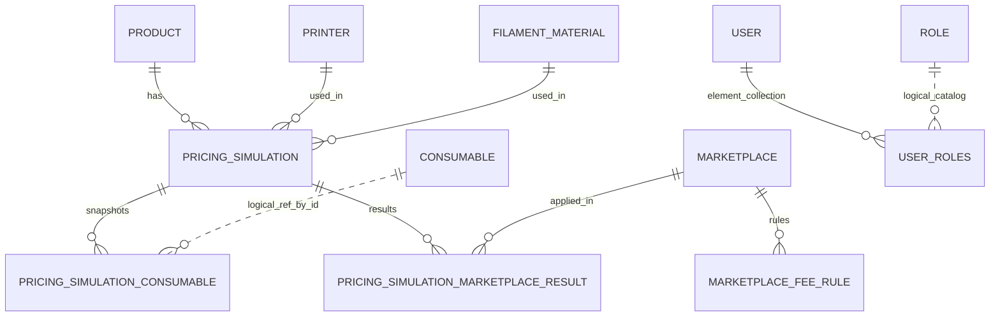

# Print Pricing API

Autor: Bruno de Lima Silva  
Video apresentacao (Desenvolvimento de Backend - Print Pricing API): https://youtu.be/59hWdaA7l4g
Video apresentação (Serviços Mobile em Cloud AWS - Print Pricing API): https://youtu.be/vfI3Z0b-FqU

API REST em Kotlin + Spring Boot para precificacao de produtos feitos com impressao 3D.

Objetivo principal:
- manter cadastro de produtos, impressoras, materiais, consumiveis, despesas e marketplaces;
- simular custo e preco de venda por cenario;
- guardar historico de simulacoes para comparacao.

## Stack
- Kotlin 2.2.21
- Spring Boot 4.0.5
- Java 21
- Spring Data JPA
- Spring Security + JWT
- H2 Database
- SpringDoc OpenAPI

## Como executar

### 1) Requisitos
- Java 21

### 2) Subir a aplicacao
```bash
cd /Users/brlimas/Documents/Projetos/backend/print-pricing-api
./gradlew bootRun
```

### 3) URLs locais
- API Base: `http://localhost:8080/api`
- Swagger UI: `http://localhost:8080/api/swagger-ui/index.html`
- OpenAPI JSON: `http://localhost:8080/api/v3/api-docs`
- H2 Console: `http://localhost:8080/api/h2-console`

### 4) Roteiro de demonstracao
Demo apenas ADMIN:
```bash
/usr/bin/env bash /Users/brlimas/Documents/Projetos/backend/print-pricing-api/demo-admin.sh
```

Demo apenas USER:
```bash
/usr/bin/env bash /Users/brlimas/Documents/Projetos/backend/print-pricing-api/demo-user.sh
```

Demo completa:
```bash
/usr/bin/env bash /Users/brlimas/Documents/Projetos/backend/print-pricing-api/demo-presentation.sh
```

Durante a demo USER, o script pede dois codigos exibidos no log da aplicacao:
- primeiro codigo: confirma um usuario novo por telefone e uuid;
- segundo codigo: confirma a troca de uuid para o mesmo telefone.

Procure no console da aplicacao a linha `SMS de confirmacao para telefone ...`.

## Autenticacao e autorizacao
A API usa JWT Bearer Token.

Fluxo:
1. autenticar em `POST /api/users/login` informando telefone e uuid do aparelho;
2. se o telefone/uuid ainda nao estiver confirmado, a API retorna `202` e envia um codigo por SMS;
3. confirmar em `POST /api/users/confirm` informando telefone, uuid e codigo;
4. autenticar novamente em `POST /api/users/login`;
5. enviar `Authorization: Bearer <token>` nas rotas protegidas.

Usuario bootstrap (criado automaticamente):
- email: `admin@authserver.com`
- telefone: `+5500000000000`
- uuid: `admin-device`

Observacao para ambiente local:
- o envio de SMS esta simulado;
- o codigo de confirmacao aparece no log da aplicacao com a mensagem `SMS de confirmacao`.
- o codigo de confirmacao expira em 5 minutos por padrao.

Regras de token:
- `USER`: expira em 48 horas
- `ADMIN`: expira em 1 hora

### Swagger (importante)
No botao `Authorize`, cole somente o token JWT (sem prefixo `Bearer `).

## Perfis de acesso
- `ADMIN`:
  - CRUD de marketplaces
  - CRUD de despesas/ativos
  - gerenciamento de roles
  - adicionar role em usuario
- `USER` e `ADMIN`:
  - CRUD de products, printers, materials, consumables
  - simulacoes de precificacao
- rotas publicas:
  - `POST /api/users`
  - `POST /api/users/login`
  - `POST /api/users/confirm`
  - Swagger/OpenAPI e H2 Console

## Estrutura de modulos
- `users`: cadastro/login e dados do usuario autenticado
- `roles`: gerenciamento de perfis de acesso
- `categories`: categorias de produto e associacao com products
- `products`: produto fisico precificavel
- `printers`: dados tecnicos e custo de maquina
- `materials`: filamentos
- `consumables`: catalogo de consumiveis
- `expenses`: despesas fixas e ativos fixos para rateio
- `marketplaces`: canais e regras de taxa
- `pricing`: simulacao e historico de precificacao
- `security`: JWT e filtros
- `exceptions`: padrao unico de erros

## Relacionamentos de entidades



Legenda:
- `||--o{` = relacionamento JPA/FK.
- `||..o{` = referencia logica (sem FK ORM direto).

## Exemplos de uso

### 1) Criar usuario
`POST /api/users`
```json
{
  "email": "user@example.com",
  "password": "Senha@123",
  "name": "Usuario Teste"
}
```

### 2) Login por telefone
`POST /api/users/login`
```json
{
  "phone": "+5511999999999",
  "uuid": "device-123"
}
```

Se o telefone e uuid ainda nao estiverem confirmados, a API retorna `202 Accepted`:
```json
{
  "status": "CONFIRMATION_REQUIRED",
  "message": "Codigo de confirmacao enviado por SMS"
}
```

### 3) Confirmar telefone e uuid
`POST /api/users/confirm`
```json
{
  "phone": "+5511999999999",
  "uuid": "device-123",
  "code": "123456"
}
```

Depois da confirmacao, chame novamente `POST /api/users/login`.

Se o codigo estiver expirado, a API remove o codigo antigo e retorna erro `400`.

Resposta de login confirmado:
```json
{
  "token": "<jwt>",
  "user": {
    "id": 2,
    "email": null,
    "phone": "+5511999999999",
    "name": "Usuário Desconhecido",
    "description": null,
    "active": true,
    "roles": ["USER"]
  }
}
```

### 4) Atualizar dados do usuario
`PUT /api/users/{id}`
```json
{
  "email": "user@example.com",
  "name": "Usuario Teste",
  "description": "Cliente que usa login por telefone"
}
```
Resposta:
```json
{
  "id": 2,
  "email": "user@example.com",
  "phone": "+5511999999999",
  "name": "Usuario Teste",
  "description": "Cliente que usa login por telefone",
  "active": true,
  "roles": ["USER"]
}
```

### 5) Product (USER ou ADMIN)
`POST /api/products`
```json
{
  "name": "Suporte de controle",
  "sku": "SUP-CTRL-01",
  "description": "Suporte para controle de videogame",
  "defaultWeightGrams": 85,
  "defaultPrintMinutes": 210
}
```

Associar categoria ao produto:
- `PUT /api/products/{productId}/categories/{categoryId}`

Desassociar categoria do produto:
- `DELETE /api/products/{productId}/categories/{categoryId}`

### 4) Printer (USER ou ADMIN)
`POST /api/printers`
```json
{
  "name": "Ender 3 S1 Plus",
  "purchasePrice": 3800,
  "maintenanceCost": 950,
  "usefulLifeHours": 5000,
  "consumptionKw": 0.3
}
```

### 5) Material (USER ou ADMIN)
`POST /api/materials`
```json
{
  "brand": "PLA Generico",
  "type": "PLA",
  "spoolCost": 100,
  "spoolWeightKg": 1,
  "color": "Branco"
}
```

### 6) Consumivel (USER ou ADMIN)
`POST /api/consumables`
```json
{
  "name": "Embalagem kraft",
  "unitCost": 2.5
}
```

### 6.1) Categoria (USER ou ADMIN para escrita, DELETE apenas ADMIN)
`POST /api/categories`
```json
{
  "name": "Decoracao",
  "description": "Produtos decorativos"
}
```

### 7) Marketplace (ADMIN)
`POST /api/marketplaces`
```json
{
  "name": "Shopee",
  "active": true,
  "feeRules": [
    {
      "name": "Comissao padrao",
      "type": "PERCENTAGE",
      "percentage": 20,
      "fixedAmount": 0
    }
  ]
}
```

### 8) Despesa fixa (ADMIN)
`POST /api/expenses/fixed`
```json
{
  "name": "Aluguel",
  "monthlyAmount": 1200,
  "allocationStrategy": "PER_MACHINE_HOUR",
  "active": true,
  "monthlyUnitsCapacity": 300,
  "monthlyMachineHoursCapacity": 160
}
```

### 9) Ativo fixo (ADMIN)
`POST /api/expenses/assets`
```json
{
  "name": "Notebook de modelagem",
  "cost": 6000,
  "usefulLifeMonths": 36,
  "allocationStrategy": "PER_MACHINE_HOUR",
  "active": true,
  "monthlyUnitsCapacity": 300,
  "monthlyMachineHoursCapacity": 160
}
```

### 10) Simulacao de precificacao (USER ou ADMIN)
`POST /api/pricing/simulations`
```json
{
  "name": "Cenario Shopee - PLA",
  "notes": "Simulacao com despesas alocadas",
  "productId": 1,
  "printerId": 1,
  "materialId": 1,
  "weightGrams": 36,
  "printMinutes": 143,
  "energyKwhCost": 0.95,
  "failureRatePercent": 12,
  "fixedCost": 3.5,
  "laborCost": 8,
  "units": 1,
  "markupMultiplier": 2,
  "taxPercent": 8,
  "consumables": [
    {
      "consumableId": 1,
      "quantity": 1
    }
  ],
  "marketplaceIds": [1]
}
```

Campos relevantes no retorno de custos:
- `material`
- `machineTotal`
- `consumables`
- `fixedExpensesAllocated`
- `fixedAssetsAllocated`
- `fixed` (soma: fixo manual + alocacoes)
- `labor`
- `failures`
- `total`
- `unit`

## Mapa rapido de rotas

### Users
- `POST /api/users` (publico)
- `POST /api/users/login` (publico)
- `GET /api/users/me` (autenticado)
- `PUT /api/users/{id}/roles/{role}` (ADMIN)

### Roles (ADMIN)
- `POST /api/roles`
- `GET /api/roles`

### Products (USER/ADMIN para escrita)
- `POST /api/products`
- `GET /api/products?name={texto}&categoryId={id}&sortBy=name|sku|createdAt&direction=ASC|DESC`
- `GET /api/products/{id}`
- `PUT /api/products/{id}`
- `DELETE /api/products/{id}`
- `PUT /api/products/{productId}/categories/{categoryId}`
- `DELETE /api/products/{productId}/categories/{categoryId}`

### Categories
- `POST /api/categories` (USER/ADMIN)
- `GET /api/categories` (autenticado)
- `GET /api/categories/{id}` (autenticado)
- `PUT /api/categories/{id}` (USER/ADMIN)
- `DELETE /api/categories/{id}` (ADMIN)

### Printers (USER/ADMIN para escrita)
- `POST /api/printers`
- `GET /api/printers`
- `GET /api/printers/{id}`
- `PUT /api/printers/{id}`
- `DELETE /api/printers/{id}`

### Materials (USER/ADMIN para escrita)
- `POST /api/materials`
- `GET /api/materials`
- `GET /api/materials/{id}`
- `PUT /api/materials/{id}`
- `DELETE /api/materials/{id}`

### Consumables (USER/ADMIN para escrita)
- `POST /api/consumables`
- `GET /api/consumables`
- `GET /api/consumables/{id}`
- `PUT /api/consumables/{id}`
- `DELETE /api/consumables/{id}`

### Marketplaces (ADMIN para escrita)
- `POST /api/marketplaces`
- `GET /api/marketplaces`
- `GET /api/marketplaces/{id}`
- `PUT /api/marketplaces/{id}`
- `DELETE /api/marketplaces/{id}`

### Expenses
- `POST /api/expenses/fixed` (ADMIN)
- `GET /api/expenses/fixed` (autenticado)
- `PUT /api/expenses/fixed/{id}` (ADMIN)
- `DELETE /api/expenses/fixed/{id}` (ADMIN)
- `POST /api/expenses/assets` (ADMIN)
- `GET /api/expenses/assets` (autenticado)
- `PUT /api/expenses/assets/{id}` (ADMIN)
- `DELETE /api/expenses/assets/{id}` (ADMIN)

### Pricing
- `POST /api/pricing/simulations` (autenticado)
- `GET /api/pricing/simulations/{id}` (autenticado)
- `GET /api/pricing/simulations?productId={id}` (autenticado)

## Erros padronizados
A API retorna um contrato unico de erro (`ApiError`) com:
- `timestamp`
- `status`
- `error`
- `message`
- `path`
- `details` (em erros de validacao)

## Documento de dominio
Detalhamento de dominio em: [docs/domain-design.md](docs/domain-design.md)
