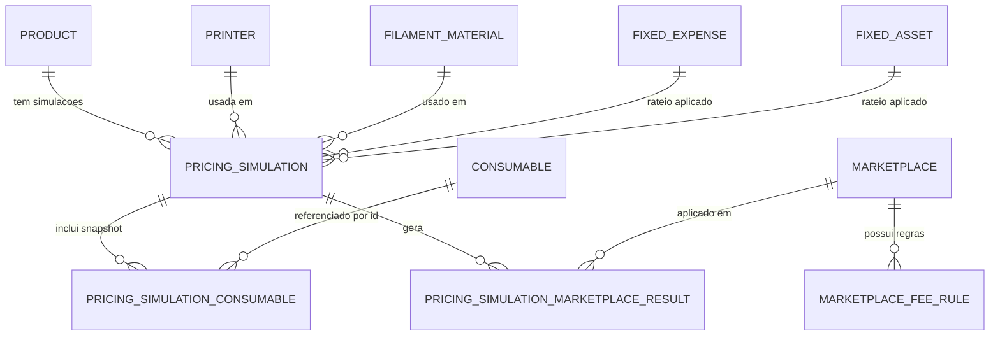
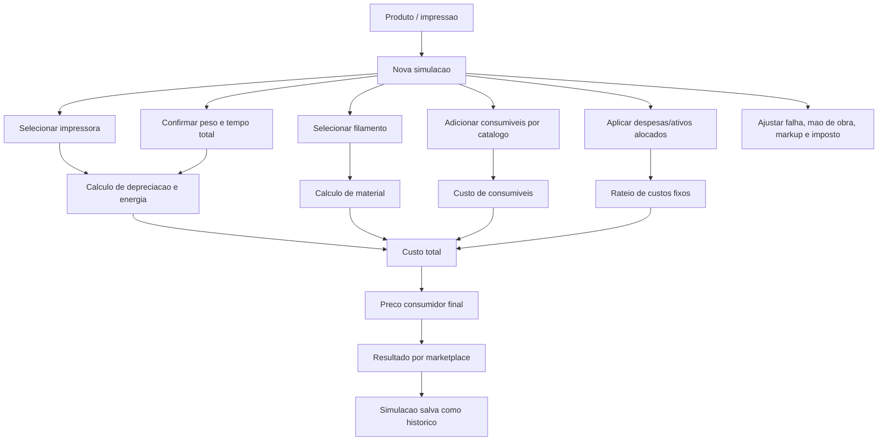
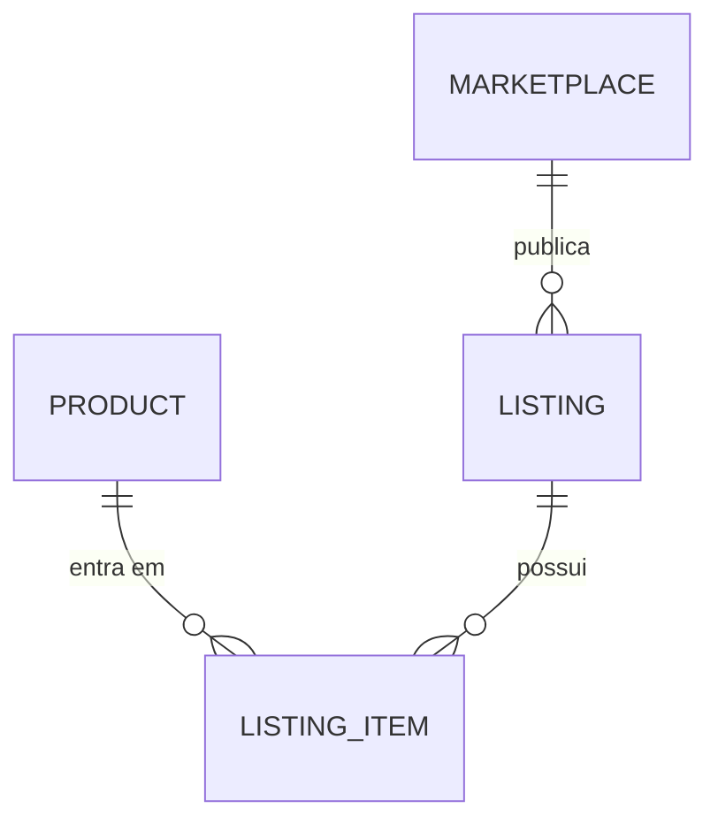

# Desenho Do Dominio

Este documento descreve o desenho atual do backend de precificacao para produtos feitos com impressao 3D.

## Conceitos

### Product
Representa o produto fisico/impressao que sera precificado.

Mesmo quando a impressao tem varias partes/STLs, para custo trabalhamos como unidade consolidada com:
- peso total;
- tempo total de impressao;
- referencia STL opcional;
- descricao e SKU.

### PricingSimulation
Representa um snapshot historico de precificacao.

Um mesmo `Product` pode ter varias simulacoes, variando por:
- impressora;
- material;
- consumiveis;
- despesas e ativos alocados;
- custo de energia;
- taxa de falha;
- mao de obra;
- markup;
- imposto;
- marketplace.

### Consumables (catalogo)
`Consumable` e um catalogo de insumos auxiliares recorrentes (embalagem, lixa, etiqueta, etc.).

Na simulacao, cada item consumido entra por `consumableId` + `quantity`. O preco unitario e o nome sao puxados do catalogo e gravados no snapshot da simulacao.

### Expenses (rateio de custo fixo)
`FixedExpense` e `FixedAsset` representam custos mensais e ativos depreciaveis para compor custo operacional.

Estrategias de rateio:
- `PER_SIMULATION`
- `PER_UNIT`
- `PER_MACHINE_HOUR`

O calculo de precificacao soma:
- custo fixo manual informado no request (`fixedCost`);
- custo alocado de despesas fixas;
- custo alocado de ativos fixos.

### Listing Ou Anuncio (futuro)
Kits, variacoes e combinacoes comerciais nao fazem parte do nucleo atual de precificacao.

Devem entrar em camada futura de listing/marketplace.

## Relacionamentos

## Fluxo De Precificacao

## Camada Futura De Anuncios

Nessa camada futura, um anuncio pode representar:
- unidade;
- kit do mesmo produto;
- bundle de produtos diferentes;
- variacoes comerciais;
- regras especificas por canal.
